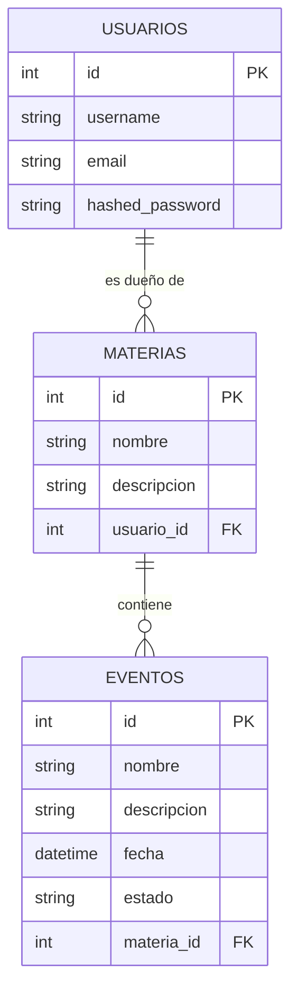
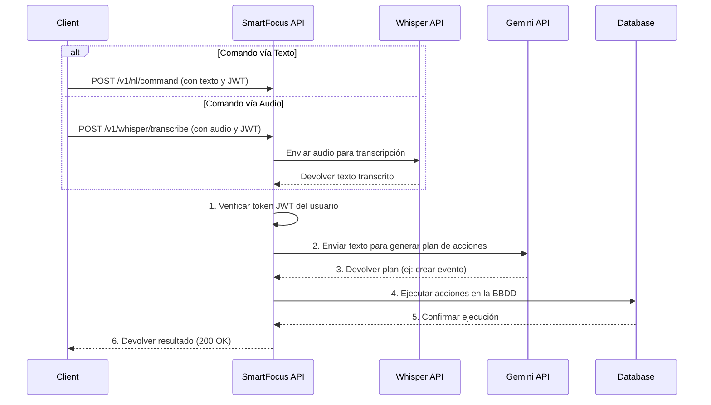

### Entregables

[Elevator pitch y Video demo](https://drive.google.com/drive/folders/1-8_IEUGDoZFjD3P0Bwc_E0rWwYzz267X?usp=sharing)


[Informe PDF](https://docs.google.com/document/d/1RWNLFnqIgU6TwNfBVo5oVZ2RNO22OuTfbsB4CIG3P2Y/edit?tab=t.0)


---

# SmartFocus API

### Secretario personal con IA para la vida académica.


---

## Menos Estrés, Mejores Resultados

En el mundo académico actual, el tiempo es el recurso más valioso y escaso. La frustración de gestionar múltiples materias, fechas de entrega y exámenes puede ser abrumadora, llevando a muchos estudiantes al límite.

**SmartFocus** nació para solucionar este problema. No es solo otra app de tareas; es un **asistente inteligente diseñado para ser tu secretario personal**. Nuestra visión es crear una herramienta tan intuitiva y potente que se convierta en un aliado fundamental en el éxito académico de sus usuarios, permitiéndoles organizarse sin esfuerzo para que puedan concentrarse en lo que realmente importa: aprender.


---

## Características Actuales (MVP)

Este proyecto es un MVP funcional que sienta las bases del proyecto. Actualmente, la API es capaz de:

*  **Procesamiento de Lenguaje Natural y Voz:** Interactúa con la API usando comandos de texto o de voz para gestionar tu agenda.
*  **Gestión Completa de Materias:** Añade, modifica y elimina tus cursos fácilmente.
*  **Organización de Eventos:** Crea tareas, recordatorios de exámenes o fechas de entrega con descripciones y plazos.
*  **Acciones Inteligentes:** Usa lenguaje natural para realizar operaciones complejas como *"elimina todos los eventos de la materia física"*.
*  **Autenticación Segura:** Sistema robusto basado en JWT para proteger la información de cada usuario.

---

##  Stack Tecnológico


---

##  Arquitectura y Flujos de Datos

El backend sigue una arquitectura limpia por capas para separar responsabilidades (`routers`, `services`, `integrations`, `models`), garantizando un código mantenible y escalable.

### Diagrama de la Base de Datos



---

### Flujo de Comando (Texto a Acción)



---

##  Guía de Inicio Rápido

Sigue estos pasos para clonar, configurar y ejecutar el proyecto en tu máquina local. Se asume que ya tienes **Git**, **Docker** y **Docker Compose** instalados.

### 1. Clona el Repositorio

Abre tu terminal y ejecuta el siguiente comando para descargar el código fuente:

```bash
git clone [https://github.com/InakiMerino0/smartfocusBackend.git](https://github.com/InakiMerino0/smartfocusBackend.git)
```

### 2. Navega al Directorio del Proyecto
Una vez clonado, entra en la carpeta del proyecto:

Bash
```
cd smartfocusBackend
```
### 3. Crea tu Archivo de Configuración (.env)
El proyecto utiliza variables de entorno para gestionar claves de API y configuraciones. Debes crear tu propio archivo .env a partir de la plantilla proporcionada.

Bash
```
cp .env.example .env
```
### 4. Configura tus Variables de Entorno
Ahora, abre el archivo .env que acabas de crear con tu editor de texto preferido. Es crucial que añadas tus propias claves de API y credenciales para que la aplicación funcione.

```
# .env

# --- PostgreSQL Database ---
POSTGRES_USER=tu_usuario_de_db
POSTGRES_PASSWORD=tu_contraseña_segura
POSTGRES_DB=smartfocusdb
DB_HOST=db
DB_PORT=5432

# --- JWT Authentication ---
SECRET_KEY=genera_una_clave_secreta_larga_y_aleatoria
ALGORITHM=HS256
ACCESS_TOKEN_EXPIRE_MINUTES=30

# --- External APIs ---
GEMINI_API_KEY=tu_clave_de_api_de_google_gemini
OPENAI_API_KEY=tu_clave_de_api_de_openai

```
### 5. Levanta los Servicios con Docker Compose
Este comando leerá el archivo docker-compose.yml, construirá las imágenes de la API y la base de datos, y las ejecutará en contenedores aislados en segundo plano (-d).

Bash
```
docker-compose up -d
```
### 6. Verifica que Funciona 
Si todo ha ido bien, la API estará funcionando. La mejor forma de probarla es a través de la documentación interactiva de Swagger UI, que te permite interactuar con todos los endpoints directamente desde el navegador.

API disponible en: http://localhost:8000

Documentación Interactiva: http://localhost:8000/docs


## Roadmap a seguir

[ ] IA Avanzada: Mejorar el motor de NLP para entender peticiones mucho más complejas y contextuales.

[ ] Roadmaps de Estudio: Generación automática de planes de estudio para preparar exámenes.

[ ] Estados Personalizables: Permitir a los usuarios crear estados personalizados para sus tareas y eventos, al estilo Notion.

[ ] Integración OAuth con Calendarios Externos: Sincronización con Google Calendar, Notion Calendar, etc.
